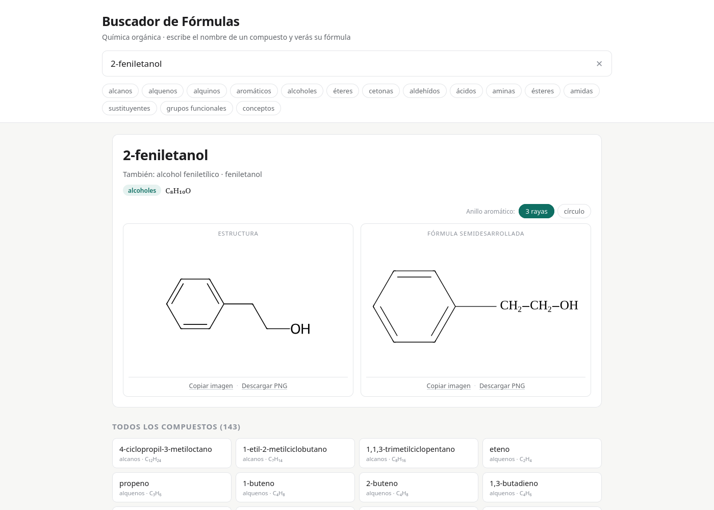

# Buscador de Fórmulas


**Química orgánica en un solo archivo HTML.** Escribe el nombre de un
compuesto —o busca por fórmula molecular— y ves su estructura y su fórmula
semidesarrollada, dibujadas como en los apuntes de clase. Funciona sin
internet, sin instalar nada y en cualquier navegador.



## Cómo se usa

1. Descarga [`dist/Buscador_de_Formulas.html`](dist/Buscador_de_Formulas.html)
   (en GitHub, Botón de descarga **⤓** o **Raw**) y ábrelo con doble clic.
2. Escribe el nombre en el buscador: la lista aparece mientras escribes.
   También acepta alias («anisol», «mCPBA»…), fragmentos («butan») y fórmulas
   moleculares (C4H8O).
3. Cada ficha enseña dos vistas: **Estructura** (líneas) y **Fórmula
   semidesarrollada**, igual que en los apuntes.
4. Debajo de cada dibujo hay dos botones: **Copiar imagen** (al portapapeles,
   para pegarla en un documento) y **Descargar PNG**.
5. Si el nombre no está en el catálogo, **Intentar construir** lo interpreta
   sobre la marcha (el resultado lleva un aviso, porque es automático).

Como todo va dentro del archivo, se puede mandar por correo o por WhatsApp y
funciona igual aunque no haya conexión.

## Qué incluye

**143 entradas: 119 compuestos y 24 fichas** (grupos funcionales y conceptos),
organizadas en quince familias: alcanos, alquenos, alquinos, aromáticos,
alcoholes, éteres, cetonas, aldehídos, ácidos, aminas, ésteres, amidas,
sustituyentes, grupos funcionales y conceptos.

Detalles que se pueden conmutar en pantalla:

| Conmutador | Para qué |
|---|---|
| Anillo aromático: **3 rayas / círculo** | Las dos formas del curso |
| **2 puntos** en el nitrógeno | Como en los apuntes (`N̈`) |
| **COOH** junto o desarrollado | `COOH` / `C(=O)-OH` |
| **CH₂ seguidos** sueltos o agrupados | `CH2-CH2-CH2` / `(CH2)3` |

## ¿De dónde salen los datos?

Está basado en apuntes de química de clase: de ahí salen los compuestos y
grupos que recoge la base de datos.

## Añadir o cambiar compuestos

Todo está en [`datos/compuestos.toml`](datos/compuestos.toml), un archivo de
texto editable con ejemplos al final. Para añadir un compuesto:

1. Copia un bloque `[[compuesto]]` (o `[[ficha]]`) y rellena `id`, `nombre`,
   `alias`, `familia`, `smiles` y, si quieres, `condensada` y `notas`.
2. Regenera el archivo único:

```bash
./generar.sh
```

Eso valida la base, pasa los tests y vuelve a escribir
`dist/Buscador_de_Formulas.html`.

## Desarrollo

Requisitos: **Python 3.11+** con [RDKit](https://www.rdkit.org/) y **Node.js**
(solo para el test del parser).

```bash
python3 -m venv .venv
.venv/bin/pip install -r requirements.txt

./generar.sh
```

Tests sueltos:

```bash
.venv/bin/python tests/test_datos.py    # base de datos y dibujos
.venv/bin/python tests/test_postura.py  # reglas de postura y geometría
.venv/bin/python tests/test_parser.py   # parser de nombres vs. catálogo
```

### Estructura

| Ruta | Qué es |
|---|---|
| `datos/compuestos.toml` | La base de datos editable (compuestos y fichas) |
| `src/catalogo.py` | Lee y valida la base de datos |
| `src/dibujo_esqueleto.py` | Estructuras de líneas, con RDKit |
| `src/postura.py` | La colocación de cada molécula (las reglas de postura) |
| `src/dibujo_condensada.py` | Fórmulas semidesarrolladas, con motor propio |
| `src/construir.py` | Empaqueta el HTML único y resuelve las vistas de cada conmutador |
| `src/plantilla/` | La aplicación: HTML, CSS, JS y parser |
| `tests/` | Comprobaciones de datos, dibujos, postura y parser |
| `dist/Buscador_de_Formulas.html` | El entregable |
| `.claude/skills/` | Skills de agente (ver abajo) |

### Cómo funciona por dentro

- **Estructuras**: RDKit convierte el SMILES en SVG, en negro sobre blanco.
- **Colocación**: cada molécula lleva una **postura** —las reglas nombradas de
  `src/postura.py`—: el 2-penten-3-ol con el -OH debajo, el metoxibenceno con
  el -OCH3 a la derecha, el éster diarílico con un anillo a cada lado… Los
  compuestos sin regla se quedan con la colocación por defecto de RDKit.
- **Semidesarrolladas**: un motor propio dibuja letras serif, subíndices y
  ramas verticales; el texto se convierte a curvas, así se ve igual en
  cualquier ordenador.
- **Nombres nuevos**: `parser.js` interpreta nombres sistemáticos en español
  (cadenas, ramas, ciclos, aromáticos, ésteres, aminas con `N-`…) y avisa
  siempre que tiene que suponer algo.
- **Todo va dentro del HTML**: los datos, las imágenes ya dibujadas, el parser
  y [smiles-drawer](https://github.com/alexandersmirnov/smiles-drawer) (MIT).

## Skills de Matt Pocock

El repositorio incluye las **37 skills de agente** de
[mattpocock/skills](https://github.com/mattpocock/skills) en `.claude/skills/`.
Son instrucciones reutilizables para trabajar en el proyecto con IA: revisar
código (`code-review`), diagnosticar fallos (`diagnosing-bugs`), diseñar
(`codebase-design`), planificar (`grilling`, `wayfinder`), escribir specs
(`to-spec`, `to-tickets`) y más.

OpenCode y Claude Code las leen automáticamente de esa carpeta. Para
actualizarlas a la última versión:

```bash
npx skills@latest update --project
```

## Licencia y créditos

MIT (ver [`LICENSE`](LICENSE)). El dibujo de estructuras usa RDKit (BSD) y el
parser incluye ideas y piezas de smiles-drawer (MIT). Las skills incluidas son
obra de [Matt Pocock](https://github.com/mattpocock) y se distribuyen con su
misma licencia MIT.

---

# Formula Finder (English)


**Organic chemistry in a single HTML file.** Type a compound name — or search
by molecular formula — and see its skeletal structure and condensed formula,
drawn exactly like the class notes. It works offline, with no installation,
in any browser.

Download [`dist/Buscador_de_Formulas.html`](dist/Buscador_de_Formulas.html)
and double-click it. That's it: the database, the pre-rendered drawings, the
name parser and the rendering library all live inside that one file, so it can
be shared by email or chat and still work without an internet connection.

**What's inside:** 143 entries (119 compounds + 24 reference cards) across 15
families, with toggles for the aromatic ring style (alternating bonds vs.
circle), the nitrogen lone pair (`N̈`), and two condensed-formula layouts.

**Where the data comes from:** chemistry class notes; the compounds and groups
in the database are taken from them.

**Editing the data:** the database is
[`datos/compuestos.toml`](datos/compuestos.toml); copy a `[[compuesto]]` block,
fill it in, and run `./generar.sh` (needs Python 3.11+, RDKit, and Node.js for
the parser test). The script validates the database, runs the tests, and
regenerates `dist/Buscador_de_Formulas.html`.

**Agent skills:** the repo vendors all 37
[mattpocock/skills](https://github.com/mattpocock/skills) under
`.claude/skills/`, ready for OpenCode and Claude Code. Update them with
`npx skills@latest update --project`.

**License:** MIT — see [`LICENSE`](LICENSE).
